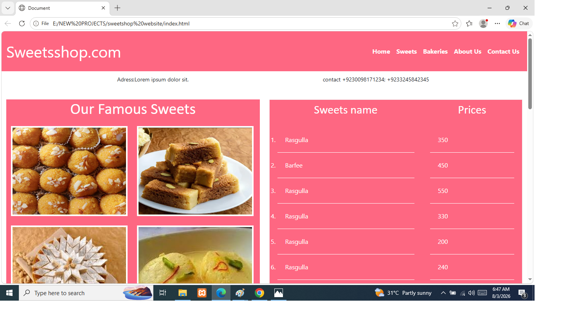
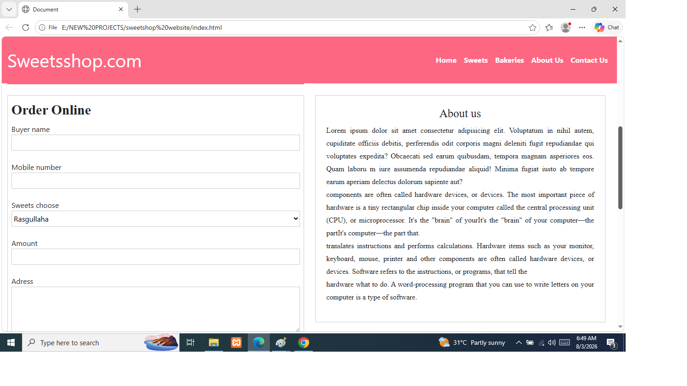
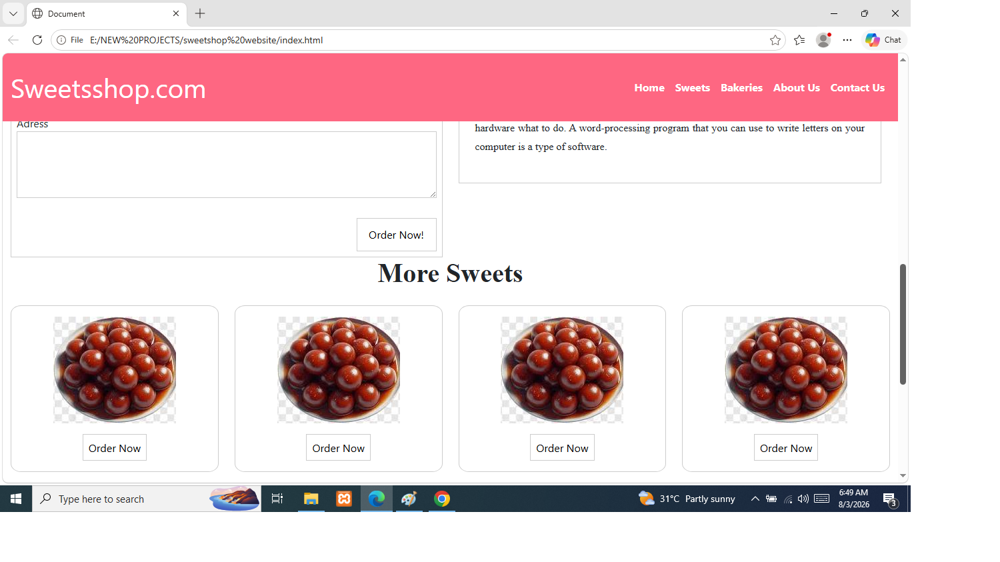
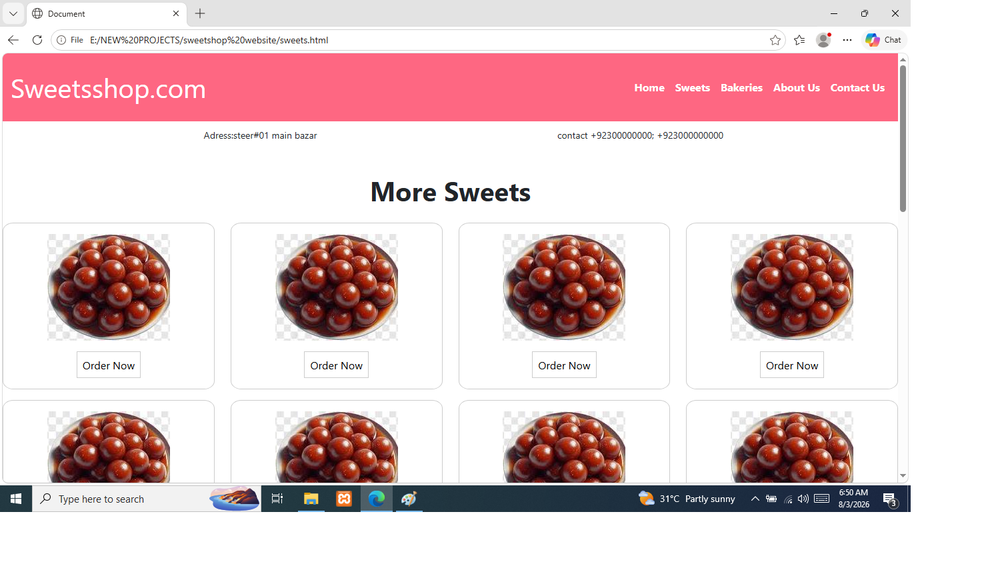
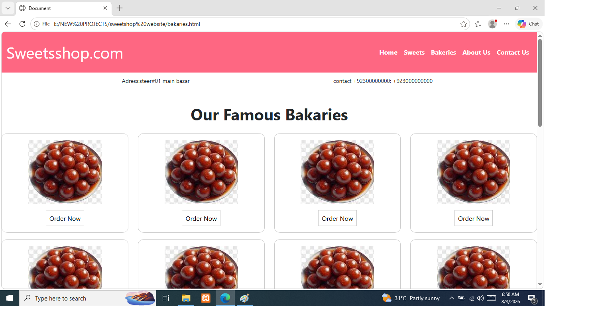

# SweetsShop Landing Page

A modern and fully responsive **SweetsShop Landing Page** built using **HTML5, CSS3, and Bootstrap**.

This project was created to practice frontend web development and responsive website design.

## Features

* Fully responsive design
* Modern sweets shop landing page
* Hero section
* Sweets/product showcase
* About section
* Order form
* Responsive navigation bar
* Bootstrap responsive grid
* Custom CSS styling
* Mobile, tablet, and desktop support

## Technologies Used

* HTML5
* CSS3
* Bootstrap

## Screenshots

### Screenshot 1

### Screenshot 2

### Screenshot 3

### Screenshot 4

### Screenshot 5

## How to Run

1. Download or clone this repository.
2. Open the project folder.
3. Open `index.html` in your browser.

No server or additional installation is required.

## Responsive Design

The website is designed to work across different screen sizes:

* Desktop
* Laptop
* Tablet
* Mobile

## Purpose

This project helped me practice:

* Building websites with HTML5
* Styling websites with CSS3
* Using Bootstrap
* Creating responsive layouts
* Designing a real-world business landing page
* Organizing a frontend project for GitHub

## Future Improvements

Possible future improvements include:

* Adding JavaScript interactions
* Adding a shopping cart
* Adding backend functionality
* Adding a database
* Adding online order processing
* Adding product filtering

## Author

**Sammir Ahmad**

Frontend Web Development Student
